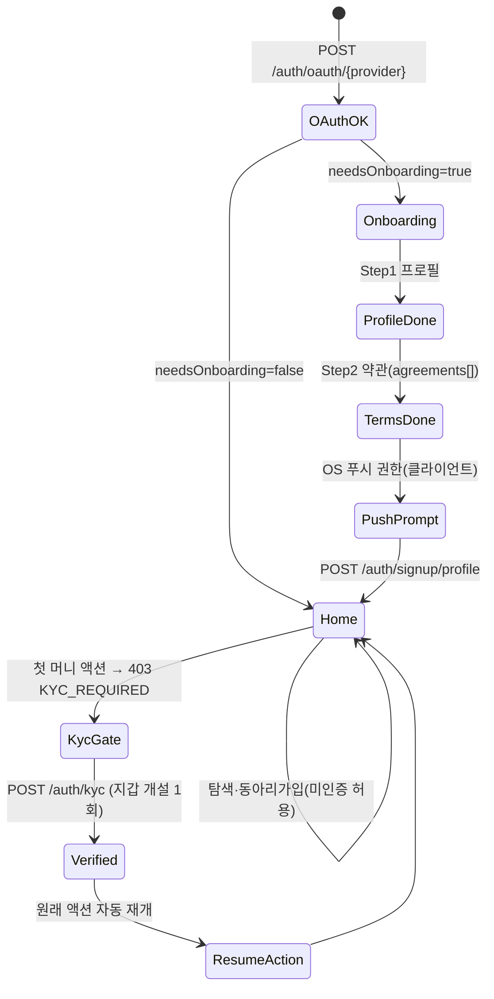

# 가입·KYC·verified 게이트 저니 리뷰

## 1. 현재 플로우

현재 목업/앱의 화면 전이는 다음 3단계로, 마지막 단계가 머니 규칙을 우회한다.

```
[LoginScreen] ──소셜 버튼 탭──▶ [OnboardingScreen] ──"모이쇼 시작하기"──▶ /app (홈)
  카카오/애플/구글            닉네임 + 자기소개(선택) + 관심사(선택) + 약관 체크박스 1개
```

- **LoginScreen** (`login_screen.dart` / 프로토타입 `LoginScreen`): 로고 + 슬로건 + 소셜 3종 버튼. 어떤 버튼을 눌러도 `context.go('/onboarding')` — **provider 구분 없이 동일 라우팅**(OAuth 코드 교환 stub). 하단 약관 텍스트는 비링크 정적 텍스트.
- **OnboardingScreen** (`onboarding_screen.dart` / 프로토타입 `SignupScreen`): `LinearProgressIndicator(value: 0.5)` 진행바, 닉네임(필수)·자기소개(선택·≤60)·관심사 칩(선택)·`[필수] 이용약관 및 금융 장부 기록 이용 동의` 체크박스 1개. `_ready = 닉네임 && 약관` 충족 시 버튼 활성 → `context.go('/app')`로 **곧장 홈**.
- **stub/누락 영역**:
  - 본인인증(KYC) 화면 **없음**. `/auth/kyc` 미연동. `verified` 상태 개념이 클라이언트에 부재.
  - 결제수단 연결(`/me/payment-accounts/kakao`) 화면 **없음**.
  - 약관 상세/버전/필수·선택 분리 **없음** (단일 bool 체크박스).
  - 알림 권한(OS push) 요청 단계 **없음**, `/me/notification-prefs` 토글 화면 **없음**.
  - verified 게이트(403 KYC_REQUIRED) 핸들링 **없음** — 예치/충전/현금화/카카오연동 화면 자체가 아직 미구현(`features/`에 wallet/deposit feature 없음).
  - `needsOnboarding` 분기 **없음** — 기존 가입자 재로그인 시에도 온보딩을 다시 거치는 구조.

핵심 진단: **온보딩이 KYC를 흡수한 것처럼 보이지만 실제로는 KYC를 통째로 건너뛴 채 홈으로 보낸다.** `value: 0.5` 진행바는 설계상 2단계였던 흔적(드롭된 KYC/약관상세 단계)이다.

---

## 2. 갭·논리모순·누락 엣지케이스

**[CRITICAL] 약관 동의가 단일 bool — 버전·필수/선택·타임스탬프 기록 불가**
`User.agreedTerms: bool` 하나로 "이용약관+개인정보+전자금융거래(필수)"와 "마케팅 수신(선택)"을 한꺼번에 삼킨다. CLAUDE.md §11의 **선불업 등록 유예 전제**에서는 전자금융거래 약관 버전별 동의 이력(누가·언제·어느 문서 버전에)이 컴플라이언스 핵심 증빙이다. `/me/legal/agreements`는 현재 **GET만** 있어 *기록*할 경로가 없다. 예: 약관 v2 개정 후 재동의가 필요한데, bool로는 "v1에 동의함"과 "v2에 동의함"을 구분 못 해 분쟁 시 입증 실패.

**[CRITICAL] verified 게이트를 온보딩이 우회 — 미인증 유저가 홈에서 금융 진입점에 노출**
온보딩이 곧장 `/app`으로 보내므로 `verified=false` 유저가 홈에 진입한다. 머니 규칙상 예치·충전·현금화·카카오연동은 `verified` 게이트(403 KYC_REQUIRED)다. 클라이언트에 게이트 핸들링이 없으면 미인증 유저가 "예치/충전" 버튼을 눌렀을 때 **원시 403 에러 토스트**만 보고 막히거나, 더 나쁘게는 비활성 처리 없이 결제 시도가 흘러간다. 핵심 질문("미인증 유저가 예치/충전 누르면?")에 대한 현재 답은 "정의 안 됨".

**[HIGH] `needsOnboarding` 분기 부재 — 기존 유저 재로그인 시 온보딩 반복**
`AuthToken.needsOnboarding: bool`이 계약에 있는데 로그인 화면은 무조건 `/onboarding`으로 보낸다. 이미 프로필을 채운 복귀 유저가 매번 온보딩을 다시 본다. `needsOnboarding`과 `verified`는 **직교(orthogonal)** 개념(온보딩 완료했어도 미인증일 수 있음)인데 클라이언트가 둘 다 무시한다.

**[HIGH] KYC 재호출 시 지갑 중복 생성 위험**
데이터정의서: User **1—1 Wallet**. `/auth/kyc`는 호출 시 verified 부여 + 지갑 개설을 함께 한다. 이미 verified인 유저가 (네트워크 재시도·딥링크 복귀로) `/auth/kyc`를 재호출하면 **두 번째 지갑이 생기면 안 된다**(잔액=분개 합 불변식이 어느 지갑 기준인지 모호해짐). KYC는 멱등 키 대상은 아니지만, 서버가 "이미 verified면 기존 지갑 반환"으로 동작해야 한다 — 현재 명세에 이 안전동작이 명시 안 됨.

**[HIGH] 본인인증 키(`phone`)와 OAuth 이메일의 동일성 검증 누락**
데이터정의서: `phone`은 "본인인증·입금자 매칭 키". 카카오 OAuth는 이메일/닉네임을 주지만 실명·휴대폰은 KYC(PASS/통신사)에서 온다. 동일인이 카카오 계정 A로 가입 후 다른 사람 명의 휴대폰으로 KYC하면 **계정-실명 불일치**가 발생한다. 입금자 매칭·현금화 계좌 검증이 phone 기준이므로, KYC 시 OAuth 신원과 본인인증 신원의 충돌 처리(예: 동일 phone이 이미 다른 userId에 묶임 → CONFLICT)가 정의돼야 한다.

**[MEDIUM] OS 푸시 권한과 서버 알림 토글의 혼동**
"알림권한" 요청은 OS 레벨 권한 프롬프트(클라이언트 전용, **API 없음**)이고, `/me/notification-prefs`는 서버 토글(funding/show/member)이다. 현재 둘 다 없는데, 둘을 한 화면에서 섞으면 "OS 권한 거부 = 서버 토글 OFF"로 잘못 동기화되기 쉽다. 권한 거부 후에도 인앱 알림함(`/me/notifications`)은 동작해야 한다.

**[MEDIUM] 관심사 칩이 고정 8개 — 데이터정의서는 "자유 추가형"**
`onboarding_screen.dart`의 `_tags`는 하드코딩 8개. 데이터정의서 `interests: "#밴드 #독서 (자유 추가형)"`와 모순. 탐색(`/discover/keywords`)·추천과 연결될 관심사 어휘가 클라이언트에 박제돼 확장 불가.

**[MEDIUM] 약관 미동의/이탈 시 부분 가입 상태 처리 없음**
OAuth는 성공(서버에 User 생성)했지만 온보딩 약관 미동의로 이탈하면 — `verified=false`, `agreedTerms=false`인 **유령 계정**이 남는다. 재진입 시 어디부터 재개하는지(닉네임만 비었나, 약관만 비었나) 분기가 없다.

---

## 3. 개선된 유저 플로우

핵심 원칙(advisor 확인): **KYC는 온보딩 단계가 아니라 금융 행위 직전 just-in-time으로 서버가 엔드포인트별 강제**한다. 온보딩 = 프로필 + 약관까지만 → 홈. 미인증 유저도 탐색·동아리 가입은 가능하고, **첫 머니 액션에서만** KYC 게이트를 만난다.

### 화면 추가/순서 변경
1. **LoginScreen**: provider별 OAuth 코드 교환. 응답의 `needsOnboarding`으로 분기 — `true`면 온보딩, `false`면 곧장 `/app`. (재로그인 반복 제거)
2. **OnboardingScreen을 2스텝으로 분리** (진행바 `0.5`→`1.0` 의미 회복):
   - **Step 1 — 프로필**: 닉네임(필수)·자기소개(선택)·관심사(서버 어휘 + 자유 추가).
   - **Step 2 — 약관 상세**: 필수 3종(이용약관·개인정보·전자금융거래) + 선택(마케팅) **개별 체크 + 전체동의**, 각 항목 [보기]로 본문. → `agreements[]`로 기록.
   - 완료 → **OS 푸시 권한 프롬프트**(클라이언트, 거부해도 진행) → `/app`(홈).
3. **홈 진입 후 KYC는 강제하지 않음.** 미인증 유저에게 홈 상단에 비차단형 "본인인증하고 회비 모으기 시작하기" 배너(선택적 진입점)만 노출.
4. **KYC 게이트(신규 화면 `KycScreen`)**: 사용자가 예치/충전/현금화/카카오연동을 처음 누르면 403 KYC_REQUIRED → KYC 바텀시트/화면 → 성공 시 `verified=true` + 지갑 개설 → **원래 누른 액션으로 자동 복귀**(딥링크 복귀 포함).
5. **PaymentAccountConnectScreen / ChargeScreen** 게이트 체인 연결.

### "미인증 유저가 예치 탭" 상태머신

```
홈(verified=false)
  │ 예치 버튼 탭
  ▼
POST /meetings/{id}/rounds/{rid}/deposit  ──▶ 403 KYC_REQUIRED
  │
  ▼ KycScreen (본인인증: 카카오/통신사/아이핀)
POST /auth/kyc ──▶ verified=true + Wallet 개설(balance=0)
  │ (이미 verified면 기존 지갑 반환 — 중복 생성 금지)
  ▼ 결제수단 확인
  ├─ 계정 없음 ─▶ POST /me/payment-accounts/kakao (verified) ─┐
  ▼                                                          │
  잔액 확인 ◀──────────────────────────────────────────────┘
  ├─ 부족(402 INSUFFICIENT_POINTS) ─▶ POST /me/wallet/charge (Idempotency-Key) ─┐
  ▼                                                                            │
  POST /meetings/{id}/rounds/{rid}/deposit (Idempotency-Key) ◀─────────────────┘
  │ 차수 상태 OPEN 일 때만
  ▼
예치 완료 → Deposit(OPEN)   [LOCKED면 409 LOCKED로 차단]
```

### 가입 상태 전이 (verified ⟂ needsOnboarding)



머니 저니 상태(OPEN/LOCKED/WITHDRAWN/SETTLING)는 KYC 통과 *이후*의 예치 단계에서만 진입하므로, 본 저니는 그 **전제 게이트**를 담당한다.

---

## 4. 백엔드 의존 데이터 — 샘플 JSON

```json
{
  "authToken_afterOAuth_newUser": {
    "accessToken": "eyJhbGciOiJIUzI1NiIsInR5cCI6IkpXVCJ9.access.signature",
    "refreshToken": "eyJhbGciOiJIUzI1NiIsInR5cCI6IkpXVCJ9.refresh.signature",
    "needsOnboarding": true,
    "user": {
      "id": "u_8fK2pQ",
      "nickname": null,
      "email": "hong@kakao.com",
      "photo": "https://cdn.moisho.app/oauth/kakao/8fK2pQ.jpg",
      "bio": null,
      "interests": [],
      "verified": false,
      "provider": "kakao",
      "createdAt": "2026-06-24T05:12:30.000Z"
    }
  },

  "user_afterOnboarding_unverified": {
    "id": "u_8fK2pQ",
    "nickname": "홍길동",
    "email": "hong@kakao.com",
    "phone": null,
    "photo": "https://cdn.moisho.app/oauth/kakao/8fK2pQ.jpg",
    "bio": "주말 풋살 좋아합니다",
    "interests": ["#풋살", "#사진"],
    "verified": false,
    "provider": "kakao",
    "createdAt": "2026-06-24T05:12:30.000Z"
  },

  "user_afterKyc_verified": {
    "id": "u_8fK2pQ",
    "nickname": "홍길동",
    "email": "hong@kakao.com",
    "phone": "+821012345678",
    "photo": "https://cdn.moisho.app/oauth/kakao/8fK2pQ.jpg",
    "bio": "주말 풋살 좋아합니다",
    "interests": ["#풋살", "#사진"],
    "verified": true,
    "provider": "kakao",
    "createdAt": "2026-06-24T05:12:30.000Z"
  },

  "kycResponse": {
    "verified": true,
    "wallet": {
      "id": "w_8fK2pQ",
      "balance": 0,
      "currency": "KRW",
      "accountLabel": "홍길동의 포인트"
    }
  },

  "trustProfile_seed": {
    "score": 0,
    "grade": "seed",
    "temp": 36.5,
    "manner": { "praises": 0, "punctual": 0, "noshow": 0, "response": 0 },
    "receiptRate": 0,
    "hosted": 0,
    "joined": 0,
    "delays": 0
  },

  "legalAgreements_recorded": [
    { "code": "tos",            "version": "2026-05-01", "required": true,  "agreed": true, "agreedAt": "2026-06-24T05:13:10.000Z" },
    { "code": "privacy",        "version": "2026-05-01", "required": true,  "agreed": true, "agreedAt": "2026-06-24T05:13:10.000Z" },
    { "code": "efin_transaction","version": "2026-05-01","required": true,  "agreed": true, "agreedAt": "2026-06-24T05:13:10.000Z" },
    { "code": "marketing",      "version": "2026-05-01", "required": false, "agreed": false, "agreedAt": null }
  ],

  "notificationPrefs_default": { "funding": true, "show": true, "member": true },

  "paymentAccounts_beforeConnect": [],

  "paymentAccounts_afterKakaoConnect": [
    {
      "id": "pa_kakao_8fK2pQ",
      "provider": "kakao",
      "label": "카카오페이",
      "maskedAccount": "kakaopay-****12",
      "connectedAt": "2026-06-24T05:20:00.000Z"
    }
  ],

  "gateError_depositWhileUnverified": {
    "error": {
      "code": "KYC_REQUIRED",
      "message": "본인인증 후 이용할 수 있어요.",
      "details": { "resumeAction": "deposit", "meetingId": "m_77a1", "roundId": "r_3" }
    }
  }
}
```

> 참고(추정): `legalAgreements[]`의 `code`/`version`/`required` 필드 구조는 데이터정의서가 `agreedTerms: bool`만 명시하므로 본 리뷰의 제안 스키마다. `phone` 포맷은 E.164로 가정.

---

## 5. API 정합 (요청 형식)

| 플로우 스텝 | 상태 | Method | URI | 설명 | Request 샘플 | Response 샘플 |
|---|---|---|---|---|---|---|
| 소셜 로그인/가입 | **[EXISTS]** `/auth/oauth/{provider}` (35행) | POST | `/auth/oauth/kakao` | provider별 코드 교환. `needsOnboarding`으로 분기 (public) | `{"authorizationCode":"abc123","redirectUri":"moisho://auth/kakao"}` | `{"accessToken":"...","refreshToken":"...","needsOnboarding":true,"user":{"id":"u_8fK2pQ","verified":false,...}}` |
| 온보딩 프로필 저장 | **[MODIFY]** `/auth/signup/profile` (59행) — `agreedTerms: bool` → `agreements[]` 배열 수용(버전·필수/선택 기록) | POST | `/auth/signup/profile` | 프로필 + 약관 이력 저장 (auth) | `{"nickname":"홍길동","bio":"주말 풋살 좋아합니다","interests":["#풋살","#사진"],"agreements":[{"code":"tos","version":"2026-05-01","agreed":true},{"code":"privacy","version":"2026-05-01","agreed":true},{"code":"efin_transaction","version":"2026-05-01","agreed":true},{"code":"marketing","version":"2026-05-01","agreed":false}]}` | `{"id":"u_8fK2pQ","nickname":"홍길동","verified":false,...}` |
| 약관 동의 이력 기록 (대안) | **[NEW]** (현재 `/me/legal/agreements`는 125행 GET만) | POST | `/me/legal/agreements` | 개정 후 재동의 등 별도 기록 경로 (self) | `{"agreements":[{"code":"tos","version":"2026-06-01","agreed":true}]}` | `204 No Content` |
| 약관 이력 조회 | **[EXISTS]** `/me/legal/agreements` (125행) | GET | `/me/legal/agreements` | 동의 이력 조회 (self) | — | `{"items":[{"code":"tos","version":"2026-05-01","agreedAt":"2026-06-24T05:13:10.000Z"}]}` |
| 미인증 예치 시도 → 게이트 | **[EXISTS]** `/meetings/{id}/rounds/{rid}/deposit` (255행) | POST | `/meetings/m_77a1/rounds/r_3/deposit` | 미인증이면 403 KYC_REQUIRED (**verified**, Idempotency-Key) | 헤더 `Idempotency-Key: dep-8fK2pQ-r3-01` / `{"topUp":0}` | `403 {"error":{"code":"KYC_REQUIRED","message":"본인인증 후 이용할 수 있어요.","details":{"resumeAction":"deposit"}}}` |
| 본인인증 → verified + 지갑 | **[EXISTS]** `/auth/kyc` (76행) | POST | `/auth/kyc` | KYC 통과 → verified, 지갑 1회 개설(이미 verified면 기존 지갑 반환) (auth) | `{"method":"telecom","impUid":"imp_99281"}` | `{"verified":true,"wallet":{"id":"w_8fK2pQ","balance":0,"currency":"KRW"}}` |
| 카카오페이 연동 | **[EXISTS]** `/me/payment-accounts/kakao` (131행) | POST | `/me/payment-accounts/kakao` | 충전·현금화 레일 연결 (**verified**) | `{}` (서버가 OAuth 핸드셰이크) | `201 {"id":"pa_kakao_8fK2pQ","provider":"kakao","maskedAccount":"kakaopay-****12"}` |
| 포인트 충전 | **[EXISTS]** `/me/wallet/charge` (374행) | POST | `/me/wallet/charge` | 부족분 충전, 수수료 0 (**verified**, Idempotency-Key) | 헤더 `Idempotency-Key: chg-8fK2pQ-01` / `{"amount":30000}` | `{"wallet":{"balance":30000},"ledgerEntry":{"type":"charge","amount":30000}}` |
| 예치 재시도(인증 후) | **[EXISTS]** `/meetings/{id}/rounds/{rid}/deposit` (255행) | POST | `/meetings/m_77a1/rounds/r_3/deposit` | OPEN에서만, 멱등 (**verified**, Idempotency-Key) | 헤더 `Idempotency-Key: dep-8fK2pQ-r3-01` / `{"topUp":0}` | `201 {"id":"d_551","roundId":"r_3","amount":15000,"status":"OPEN"}` |
| 알림 수신 토글 | **[EXISTS]** `/me/notification-prefs` (122행) | PATCH | `/me/notification-prefs` | 서버 토글(OS 푸시 권한과 별개) (self) | `{"funding":true,"show":false,"member":true}` | `{"funding":true,"show":false,"member":true}` |
| 신뢰/매너 지표 | **[EXISTS]** `/me/trust` (112행) | GET | `/me/trust` | seed/36.5 초기값 (self) | — | `{"score":0,"grade":"seed","temp":36.5,...}` |

> OS 푸시 권한(알림권한)은 **클라이언트 전용 프롬프트로 API 없음** — `/me/notification-prefs`(서버 토글)와 구분.

### §4/§11 자체검증
- **회원 간 송금 API**: 추가 안 함. 모든 자금 이동은 충전(개인↔레일)·예치(개인→에스크로)뿐, 회원↔회원 직접 송금 경로 없음. ✅
- **충전·출금 수수료**: `/me/wallet/charge` 수수료 0 명시, 별도 fee 필드 없음. ✅
- **포인트 모임 정산 외 용도**: 신규 엔드포인트는 KYC·약관·결제수단 연결뿐, 포인트를 정산 외로 쓰는 경로 없음. ✅
- **원장 수정/삭제**: `/me/legal/agreements` POST는 약관 이력(append) 기록일 뿐 LedgerEntry를 건드리지 않음. KYC 지갑 개설은 신규 생성(중복 방지). ✅
- **멱등 누락**: 머니 op(deposit·charge)에 `Idempotency-Key` 헤더 명시. KYC는 멱등 키 대상 아님 — 대신 "이미 verified면 기존 지갑 반환" 서버 안전동작으로 지갑 중복 방지. ✅
- **verified 게이트 누락**: deposit·charge·cashout·payment-accounts/kakao 모두 verified 태그 유지, 미인증은 403 KYC_REQUIRED. 온보딩에 KYC를 강제하지 않되 머니 엔드포인트가 서버단에서 강제(just-in-time)하므로 게이트 일관. ✅
