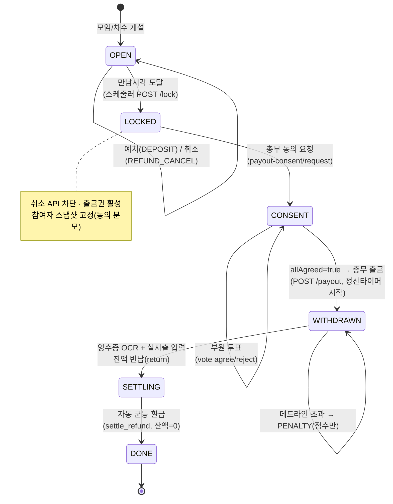

# 모임·차수 펀딩·기간제한 에스크로 저니 리뷰

## 1. 현재 플로우

**현 상태 요약**: 이 머니 저니는 **Flutter 앱에 전혀 구현되어 있지 않다.** `app/lib/features/`에는 home(쇼피드)·discover(탐색)·chat·showts·my 5탭만 존재하고, 모임 상세/차수 신청/예치/총무 화면은 **하나도 없다(전부 미구현).** 저니의 시각·동작 레퍼런스는 React 프로토타입(`*.js` 3개)에만 존재한다. 따라서 아래는 **프로토타입 기준 화면 전이**이며, 실제 앱 관점에서는 `discover_screen.dart`의 `MeetingCard` 탭 → 상세 이후가 전부 stub이다.

프로토타입 화면 전이(데모 분기 기준):

1. **탐색/피드**(`discover_screen.dart` 구현됨, 필터 동작) → 모임 카드 탭
2. **모임 상세** — 두 종류가 공존(설계 불일치, §2-A):
   - `FundingDetailScreen`(`6c5465b6`): 단일 비용 모임, "참석 신청하기·40,000원" CTA → **KakaoPaySheet** → `processing`(1.8초) → `PaymentSuccessScreen`
   - `MeetingDetailScreen`(`87338638`): 차수 탭 UI + 내 참여 상태 배지(`none→applied→deposited→locked`), "만남 시각 도래(데모)" 버튼으로 수동 `locked` 전이, "예치 취소" 버튼
3. **차수 신청** — `MeetingApplyScreen`(동아리 정기) / `FlashApplyScreen`(개인 번개, 차수당 노쇼 예약금 5,000원): 차수 체크박스 다중 선택 → 합산액 → `depositConfirm`로 네비
4. **예치 확인/성공** — `depositConfirm`(별도 화면, 코드 미확인·추정) → `PaymentSuccessScreen`("이체 완료")
5. **총무측** — `TreasurerMeetingsScreen`(내가 총무인 모임 목록, 상태 `locked/consent/...`) → `TreasurerScreen`(취합 명단·금액) → "모임 자금 출금·정산하기" → `treasurerPayout`(코드 미확인·추정)
6. **알림** — `NotificationsScreen`에 "총무 출금 동의 요청" 항목(action:`payoutConsent`)이 있으나, **이를 받는 동의/투표 화면 자체가 프로토타입에 없다(미구현).**

**stub/누락 화면**: 출금 동의 투표 화면(`payout-consent/vote`), 포인트 부족 시 충전 유도 시트, 에스크로 상태 카드, OCR 영수증·반납·자동정산 화면, 락 직전 동시성 안내. 위젯 레벨에서도 Flutter엔 전부 없음.

---

## 2. 갭·논리모순·누락 엣지케이스

**[CRITICAL] 프로토타입이 "에스크로"가 아니라 "카카오페이 모임통장 자동 수취"로 돈을 흘린다 — 머니규칙 정면 위반**
`FundingDetailScreen`/`TreasurerScreen`은 "카카오페이 이체 완료", "카카오페이 모임통장 · 자동 수취", "한 번에 송금"으로 표현한다. 그러나 `docs/05`·CLAUDE.md §2·§11은 **자금은 앱 포인트 에스크로에 묶이고 카카오페이는 충전·현금화 레일로만** 쓰며, 부원→총무통장 직접 송금은 **회원 간 송금 금지**에 해당한다. 예: 부원이 "참석 신청하기·40,000원"을 누르면 프로토타입은 KakaoPay로 총무 모임통장에 바로 꽂지만, 정본 흐름은 `보유 포인트 차감(+부족분 CHARGE)` → `DEPOSIT` 분개로 에스크로 적립이어야 한다. UI 카피·아이콘(FEE500 카카오 로고)을 전부 "포인트 예치"로 교체해야 한다.

**[CRITICAL] 출금 동의(CONSENT) 단계가 UI에 통째로 빠져 있다 — 상태머신 누락**
정본은 `LOCKED → (전원 동의) CONSENT → WITHDRAWN`이고, openapi에 `payout-consent/request·vote·GET` 3종이 명시돼 있다. 그런데 프로토타입엔 동의를 **요청하는** 화면도, 부원이 **투표하는** 화면도 없다. `NotificationsScreen`엔 "총무 출금 동의 요청" 알림만 덩그러니 있고 받을 화면이 없어 deadlink다. `TreasurerScreen`은 동의 게이트 없이 바로 "출금·정산하기"로 간다 → **전원 동의 없이 총무 출금이 가능한 것처럼 보이는 화면**으로, `409 CONSENT_PENDING` 게이트와 모순.

**[CRITICAL] 포인트 부족 시 충전 유도 플로우 부재 — 예치 핵심 분기 누락**
openapi `deposit`은 `402 INSUFFICIENT_POINTS` + body `topUp`(부족분 충전액)으로 "보유 포인트 우선 차감, 부족분 카카오페이 충전 후 예치"를 명시한다. 프로토타입엔 지갑 잔액 표시도, "보유 5,000P / 부족 35,000P 충전 필요" 분기도 없이 곧장 "이체"로 간다. 예: 지갑 0P인 부원이 40,000원 차수를 신청하면 앱은 충전 35,000~40,000원을 먼저 유도(`/me/wallet/charge`)한 뒤 예치해야 하는데, 그 단계가 화면에 없어 `402`를 받으면 막다른 길이 된다.

**[HIGH] 만남시각 락 전이가 "데모 버튼" 수동 트리거 — 자동 전이/취소권 닫힘이 검증 불가**
`MeetingDetailScreen`은 "만남 시각 도래(데모)" 버튼으로 사람이 `locked`를 누른다. 정본은 **서버 스케줄러가 `POST /meetings/{id}/lock`을 만남시각에 호출**(취소 API 차단 + 출금권 활성). 실제 앱에선 클라이언트가 락을 트리거해선 안 되고, 만남시각 카운트다운 → 자동 상태 폴링/푸시로 받아야 한다. 데모 버튼을 그대로 옮기면 부원이 임의로 락을 거는 권한 상승이 된다.

**[HIGH] "마감 전 취소"의 두 시계 혼동 — fundingDeadline vs 만남시각(lockAt)**
프로토타입은 "신청 마감 23시간 후"(fundingDeadline)와 "만남 시각 전 취소 자유"(lockAt)를 한 화면에서 섞는다. 정본은 **취소권이 닫히는 기준은 `lockAt`(만남시각)** 이지 fundingDeadline이 아니다(`docs/05`: "만남 시각 도달 → 취소 API 차단"). 예: 펀딩 마감 후~만남시각 전 구간에서 부원은 여전히 취소·환불 가능해야 하는데, "마감 임박"만 강조하면 사용자는 취소권이 이미 닫혔다고 오해한다. 취소 버튼은 `escrow.state==OPEN`에만 노출해야 한다.

**[HIGH] 정원·정족수의 분모가 흔들린다 — 동의 정족수는 락 스냅샷 고정**
`PayoutConsent.required`는 **락 시점 스냅샷 인원**(이후 예치 변동 영향 없음)인데, 프로토타입 `TreasurerScreen`은 "참석 신청 N/10명"을 라이브 카운트로 보여줘 동의 분모와 정원(max)을 구분하지 않는다. 예: 락 전 8명 예치 → 락 → 동의 분모=8 고정. 만약 UI가 "동의 6/8"의 8을 라이브 인원으로 다시 계산하면 정족수가 흔들려 `allAgreed` 판정이 깨진다.

**[MEDIUM] 멱등키·중복 예치 동시성 UI 부재**
openapi `deposit`·`payout`·`return`은 `Idempotency-Key`(uuid) 필수다. 프로토타입엔 "예치 처리 중"(1.8초 setTimeout)만 있고, **버튼 더블탭/네트워크 재시도 시 중복 예치 방지** 표현이 없다. 또 `docs/05` "동시성: 마감 직전 대량 동시 취소/출금 경합 순차 처리"에 대응하는 "처리 중 잠금" 상태가 부원·총무 양쪽 화면에 필요하다. 같은 차수 재예치 시 `409 LOCKED`/이미 예치됨도 처리해야 한다.

**[MEDIUM] 고정비(노쇼 환불 불가) 정책이 취소 환불액 계산에 반영 안 됨**
`NoshowSheet`는 "고정비 환불불가/변동비 환불가능"을 보여주지만, `MeetingDetailScreen.cancelDeposit`은 무조건 "전액 환불(40,000P 지갑 환불)"로 처리한다. `CostItem.fixed=true`면 마감 전 취소라도 고정비는 제외돼야 하는데(REFUND_CANCEL 분개액 ≠ 예치액), 두 화면의 환불 로직이 모순된다. 예: 합주실 대관료 20,000(고정)+식비 8,000(변동) 예치 후 취소 시 환불은 8,000이어야 하는데 28,000을 환불하면 에스크로 정합성이 깨진다.

**[MEDIUM] verified(KYC) 게이트 진입 UX 없음**
`deposit`은 `verified`(미인증 `403 KYC_REQUIRED`), 상세조회는 `public`이다. 프로토타입은 미인증 사용자가 "참석 신청"을 누를 때의 KYC 유도 분기가 없다. 비로그인/미인증으로 상세는 보되 예치 버튼에서 인증 플로우로 보내는 게이트가 필요하다.

---

## 3. 개선된 유저 플로우

화면 추가: ① 에스크로 상태 카드(상세 상단), ② 충전 유도 시트(부족분), ③ **출금 동의 투표 화면**(부원), ④ **동의 수집 현황 화면**(총무), ⑤ 락 직전 "처리 중" 잠금 오버레이. 데모 락 버튼 제거 → 카운트다운+폴링/푸시.

**부원 동선**: 탐색 → 모임 상세(public, 에스크로 카드) → [verified 게이트] → 차수 선택 → 예치 확인(보유 P/부족분) → (부족시) 충전 시트 → 예치 성공 → (OPEN 동안) 취소 가능 → 만남시각 자동 락 → 출금 동의 푸시 → 동의 투표 → (전원 동의·총무 출금·정산 후) 자동 환급 알림.

**총무 동선**: 총무 모임 목록 → 모임 에스크로 현황 → (LOCKED) 동의 요청 발송 → 동의 수집 현황(N/N) → (전원 동의) 출금 → 정산 타이머 → OCR 영수증·실지출 입력 → 잔액 반납 → 자동 균등정산(DONE).

상태머신(openapi `Escrow.state` 정본과 일치):



핵심 전이 규칙(UI 게이팅):
- **취소 버튼**: `state==OPEN`에서만 노출. `LOCKED` 이후 호출 시 `409 LOCKED` → "만남 시각이 지나 취소할 수 없어요".
- **충전 유도**: 예치 확인에서 `보유 < 필요`면 `topUp = 필요−보유` 자동 계산, 충전 시트 → 충전 완료 후 동일 멱등키로 `deposit` 재시도.
- **출금 버튼**(총무): `CONSENT && allAgreed`에서만 활성. 아니면 `409 CONSENT_PENDING`.
- **동의 투표**(부원): 락 스냅샷 참여자만(`403 NOT_PARTICIPANT`), 마지막 값 반영(멱등).

---

## 4. 백엔드 의존 데이터 — 샘플 JSON

```json
{
  "meeting": {
    "id": "mtg_01HZX8K3",
    "type": "club",
    "clubId": "club_sound01",
    "hostId": "usr_treasurer",
    "title": "정기 합주 & 뒷풀이",
    "category": "music",
    "datetime": "2026-06-22T09:00:00.000Z",
    "fundingDeadline": "2026-06-21T14:00:00.000Z",
    "place": "홍대 사운드스튜디오",
    "description": "월례 정기 합주 후 뒷풀이",
    "coverImg": "https://cdn.moisho.app/m/mtg_01HZX8K3.jpg",
    "costBreakdown": [
      { "label": "합주실 대관료", "amount": 20000, "fixed": true },
      { "label": "뒷풀이 식비", "amount": 20000, "fixed": false }
    ],
    "perHead": 40000,
    "currentPeople": 8,
    "rounds": [
      { "id": "rnd_1", "label": "1차", "title": "정기 합주", "time": "18:00~20:00",
        "place": "사운드스튜디오 A", "cost": 25000, "min": 5, "max": 10, "cur": 8, "status": "recruiting" },
      { "id": "rnd_2", "label": "2차", "title": "뒷풀이", "time": "20:15~22:00",
        "place": "호프집", "cost": 15000, "min": null, "max": 10, "cur": 6, "status": "closing" }
    ],
    "rules": ["정시 참석", "악기 개인 지참", "회비 미예치 시 참석 불가"],
    "status": "recruiting"
  },
  "escrow": {
    "meetingId": "mtg_01HZX8K3",
    "state": "OPEN",
    "balance": 320000,
    "participants": 8,
    "lockAt": "2026-06-22T09:00:00.000Z",
    "settlementDeadline": null
  },
  "myWallet": {
    "id": "wal_usr_minji",
    "balance": 12000,
    "currency": "KRW",
    "accountLabel": "민지 지갑"
  },
  "myDeposit": {
    "id": "dep_01HZXA2",
    "roundId": "rnd_1",
    "userId": "usr_minji",
    "amount": 25000,
    "status": "deposited",
    "depositedAt": "2026-06-20T05:12:00.000Z"
  },
  "payoutConsent": {
    "meetingId": "mtg_01HZX8K3",
    "lockAt": "2026-06-22T09:00:00.000Z",
    "required": 8,
    "agreed": 6,
    "allAgreed": false,
    "items": [
      { "userId": "usr_minji", "name": "김민지", "vote": "agree",
        "reason": null, "votedAt": "2026-06-22T09:05:00.000Z" },
      { "userId": "usr_park", "name": "박소심", "vote": "pending",
        "reason": null, "votedAt": null },
      { "userId": "usr_choi", "name": "최부원", "vote": "reject",
        "reason": "금액 확인 필요", "votedAt": "2026-06-22T09:08:00.000Z" }
    ]
  },
  "ledgerSample": [
    { "id": "led_1", "ownerType": "user", "type": "charge", "roundId": null,
      "amount": 13000, "title": "카카오페이 충전(부족분)", "date": "2026-06-20T05:11:50.000Z" },
    { "id": "led_2", "ownerType": "user", "type": "deposit", "roundId": "rnd_1",
      "amount": -25000, "title": "1차 합주 예치", "date": "2026-06-20T05:12:00.000Z" },
    { "id": "led_3", "ownerType": "escrow", "type": "deposit", "roundId": "rnd_1",
      "amount": 25000, "title": "에스크로 적립(김민지)", "date": "2026-06-20T05:12:00.000Z" }
  ]
}
```

금액은 전부 정수(원=포인트), 시간은 UTC ISO8601, `roundId`/`userId`/`meetingId` 일관. `escrow.balance(320000) = Σ DEPOSIT − Σ PAYOUT + Σ RETURN − Σ SETTLE_REFUND` 불변식 성립.

---

## 5. API 정합 (요청 형식)

(openapi.yaml 238~366행, 478~640행 grep으로 모두 검증)

| 플로우 스텝 | 상태 | Method | URI | 설명 | Request 샘플 | Response 샘플 |
|---|---|---|---|---|---|---|
| 탐색 | [EXISTS: `/discover/meetings`] | GET | `/discover/meetings?locMode=region&cursor=&limit=20` | 모임 피드(public) | — | `{ "items": [Meeting…], "nextCursor": "c_2" }` |
| 모임 상세 | [EXISTS: `/meetings/{id}`] | GET | `/meetings/mtg_01HZX8K3` | 상세(public) | — | `Meeting` 객체(§4) |
| 에스크로 카드 | [EXISTS: `/meetings/{id}/escrow`] | GET | `/meetings/mtg_01HZX8K3/escrow` | 잔액·락·인원(club.member) | — | `{ "state":"OPEN","balance":320000,"participants":8,"lockAt":"2026-06-22T09:00:00.000Z","settlementDeadline":null }` |
| 차수 참여자 | [EXISTS: `/meetings/{id}/rounds/{rid}/participants`] | GET | `/meetings/mtg_01HZX8K3/rounds/rnd_1/participants` | 명단(club.member) | — | `{ "items":[{ "userId":"usr_minji","name":"김민지","amount":25000 }] }` |
| 충전(부족분) | [EXISTS: `/me/wallet/charge`] | POST | `/me/wallet/charge` | 카카오페이 충전, 수수료0 (verified) · **Idempotency-Key 필수** | `{ "amount": 13000 }` | `ChargeReady { "tid":"T123","redirectUrl":"…","appScheme":"moisho://charge/return","amount":13000 }` |
| 차수 예치 | [EXISTS: `/meetings/{id}/rounds/{rid}/deposit`] | POST | `/meetings/mtg_01HZX8K3/rounds/rnd_1/deposit` | 보유 차감+부족분 예치(verified) · **Idempotency-Key 필수** | headers `Idempotency-Key: 7c9e…`, body `{ "topUp": 13000 }` | `201 Deposit { "id":"dep_01HZXA2","roundId":"rnd_1","amount":25000,"status":"deposited","depositedAt":"2026-06-20T05:12:00.000Z" }` / `402 INSUFFICIENT_POINTS` / `403 KYC_REQUIRED` / `409 ROUND_FULL|DEADLINE_PASSED|LOCKED` |
| 마감 전 취소 | [EXISTS: `/meetings/{id}/rounds/{rid}/deposit`] | DELETE | `/meetings/mtg_01HZX8K3/rounds/rnd_1/deposit` | OPEN에서만 즉시 환불(self) | — | `200 Deposit { "status":"refunded" }` / `409 LOCKED` |
| 만남시각 락 | [EXISTS: `/meetings/{id}/lock`] | POST | `/meetings/mtg_01HZX8K3/lock` | 스케줄러 트리거(system, 클라 호출 금지) · 멱등 | — | `200 { "state":"LOCKED" }` |
| 동의 요청 발송 | [EXISTS: `/meetings/{id}/payout-consent/request`] | POST | `/meetings/mtg_01HZX8K3/payout-consent/request` | 락 스냅샷 전원 푸시(club.treasurer) | — | `PayoutConsent { "required":8,"agreed":0,"allAgreed":false }` / `409 NOT_LOCKED` |
| 동의 현황 | [EXISTS: `/meetings/{id}/payout-consent`] | GET | `/meetings/mtg_01HZX8K3/payout-consent` | N/N·명단(club.member) | — | `PayoutConsent`(§4) |
| 동의 투표 | [EXISTS: `/meetings/{id}/payout-consent/vote`] | POST | `/meetings/mtg_01HZX8K3/payout-consent/vote` | 스냅샷 참여자만(self·participant), 멱등 | `{ "vote":"agree" }` 또는 `{ "vote":"reject","reason":"금액 확인 필요" }` | `200 PayoutConsent { "agreed":7,"allAgreed":false }` / `403 NOT_PARTICIPANT` |
| 총무 출금 | [EXISTS: `/meetings/{id}/payout`] | POST | `/meetings/mtg_01HZX8K3/payout` | LOCKED+전원동의만, 타이머 시작(club.treasurer) · **Idempotency-Key 필수** | headers `Idempotency-Key: a1b2…`, body `{ "bankAccountId":"bank_77" }` | `200 Payout { "amount":320000,"status":"withdrawn","withdrawnAt":"…","settlementDeadline":"2026-06-22T21:00:00.000Z" }` / `409 NOT_LOCKED|CONSENT_PENDING|ALREADY_WITHDRAWN` |
| 지갑 잔액 | [EXISTS: `/me/wallet`] | GET | `/me/wallet` | 예치 전 보유 P 확인(self) | — | `Wallet { "balance":12000,"currency":"KRW" }` |

추가 제안(이 저니 범위 내 갭): 예치 확인 화면이 `보유 vs 필요`를 계산하려면 `GET /me/wallet` + 차수 `cost`만으로 충분 → **NEW 엔드포인트 불필요.** 단 예치 응답에 `chargedAmount`(이번에 충전된 부족분)를 포함하면 영수증 표기가 정확해진다 → [MODIFY: `/meetings/{id}/rounds/{rid}/deposit` — `Deposit` 스키마에 `chargedAmount` 선택 필드 추가]. 고정비 부분취소를 위해서는 [MODIFY: DELETE `deposit` — OPEN 취소 시 응답에 `refundedAmount`(고정비 제외 실환불액) 명시] 권장. 둘 다 신규 path 발명 없이 기존 응답 보강.

### §4/§11 자체검증
- **회원 간 송금**: 없음. 예치는 `user→escrow` DEPOSIT 분개, 환급은 `escrow→user` SETTLE_REFUND. 부원↔부원 직접 송금 API 미도입. (프로토타입의 "총무통장 자동 수취" 카피는 §2-A에서 위반으로 적시·제거 권고)
- **수수료**: 충전·현금화·예치·출금·반납 전부 수수료 0원 유지. 표에 수수료 필드 없음. ✅
- **원장 수정**: LedgerEntry append-only. 취소·반납·환급 모두 **반대분개(REFUND_CANCEL/RETURN/SETTLE_REFUND)** 로 표현, 기존 레코드 수정·삭제 없음. ✅
- **멱등 누락**: 머니 op(charge·deposit·payout·return) 전부 `Idempotency-Key` 명시. lock/auto는 system 멱등. ✅
- **verified 누락**: deposit·charge에 verified 게이트 명시(미인증 `403 KYC_REQUIRED`), 상세·탐색은 public. 출금·동의는 club.treasurer/self·participant 권한 태그 명시. ✅

(주의: 프로토타입 자체는 §2의 CRITICAL 3건—KakaoPay 직접송금 표현·동의단계 누락·충전유도 부재—에서 머니규칙과 충돌하므로, Flutter 구현 시 본 §3/§5 흐름으로 교정해야 함. 미확인 화면(`depositConfirm`, `treasurerPayout` 본문)은 "추정"으로 표기했다.)
