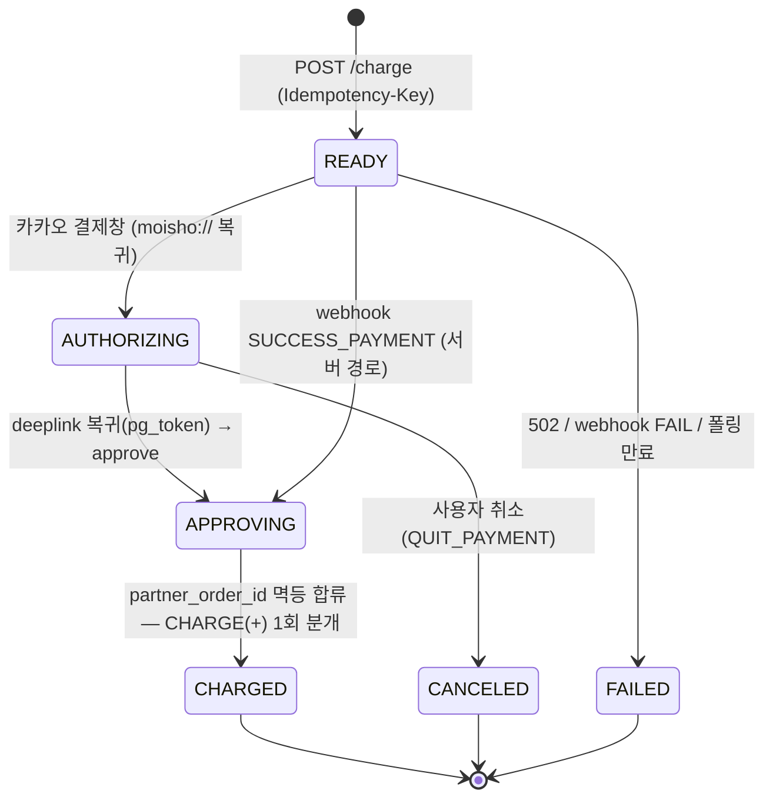
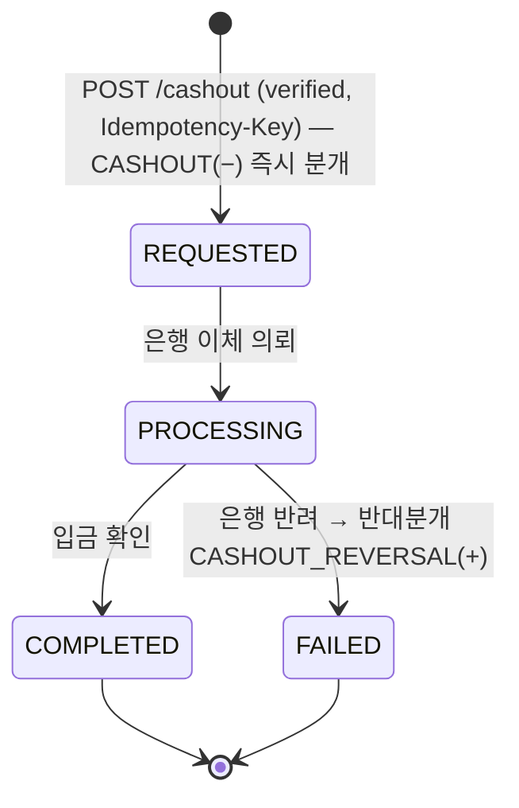

# 포인트 지갑·충전·현금화 저니 리뷰

## 1. 현재 플로우

**Flutter 앱 (현재 빌드된 5탭)**: 지갑 저니는 **전혀 구현되지 않음**. 마이 탭(`my_page_screen.dart`)에 "내 포인트 지갑 · 충전·현금화" 그라데이션 카드(`_walletCard`, L183)가 있으나, 탭하면 `onTap: _stub` → `MoishoToast.show(context, '준비 중인 화면이에요', tone: 'info')`(L73, L186). **진입점만 그려진 데드 스텁**이다. WalletScreen/WalletChargeScreen/WalletCashoutScreen 라우트는 Flutter에 없음.

**프로토타입(React, `5b8ddc3c-01d.js`)에 디자인만 존재**하는 화면 전이:

```
마이탭 지갑카드 → [walletScreen]  내 포인트 지갑
   ├─ 잔액 hero(보유 128,400P / 사용가능 83,400P / 예치중 🔒 45,000P)
   ├─ [충전] → [walletCharge]  프리셋(1·3·5·10만) → "카카오페이로 N P 충전" 버튼
   │            → pushToast("충전 완료! 🎉") + onBack()           ← 즉시 성공 (stub)
   ├─ [현금화] → [walletCashout] 출금계좌(하드코딩 "국민은행…홍길동·본인명의")
   │            + 슬라이더 금액 → "N원 현금화하기"
   │            → pushToast("출금 신청 완료") + onBack()           ← 즉시 성공 (stub)
   ├─ 예치중인 모임 리스트 → [meetingDetail]
   └─ 포인트 내역(LEDGER 6건: settle_refund/deposit/charge/refund_cancel/cashout)
```

stub인 곳: **결제수단(카카오페이) 연동 화면 자체가 없음**(바로 충전 버튼). 충전·현금화가 **동기 토스트로 즉시 완료** 처리 — 카카오페이 redirect/approve/webhook 비동기 왕복, pending 상태, 실패/취소 분기가 전부 빠짐. 출금 계좌는 하드코딩, 등록·검증 플로우 없음.

---

## 2. 갭·논리모순·누락 엣지케이스

**[CRITICAL] 충전 approve(딥링크 복귀) 단계가 계약에 없어 실제로 충전이 완결되지 않는다.**
카카오페이 `pg_token`은 **클라이언트 redirect(`moisho://` 복귀)에서만** 전달되고 webhook에는 없다. 따라서 ready 후 사용자 인증 → 딥링크 복귀 → 서버 **approve(pg_token)** → 확정의 흐름이 필요한데, openapi에는 `/me/wallet/charge`(=ready)와 `/payments/kakao/webhook`만 있고 **approve 엔드포인트가 없다**(`grep approve|pg_token` → 충전 경로엔 0건). 프로토타입은 L160에서 `pushToast("충전 완료")` 즉시 토스트로 이 공백을 은폐. → 충전이 영원히 `ready`에 머물거나, UI가 거짓 성공을 표시. pending 상태가 반드시 필요.

**[CRITICAL] approve↔webhook 이중확정 멱등 합류가 미정의(머니규칙 §4.5).**
approve(클라이언트·pg_token)와 webhook(서버·SUCCESS_PAYMENT)이 **같은 `partner_order_id`를 동시에 확정**하려 한다. "이중 확정 금지"의 정확한 의미 = **CHARGE LedgerEntry는 정확히 1회만** 분개. 먼저 도달한 쪽이 `+charge` 분개를 쓰고 둘째는 no-op. 이 합류 규칙이 어디에도 명시되지 않아 구현 시 더블 충전(잔액 2배) 위험. 예: webhook이 200ms 먼저 와서 +50,000P 분개 → 0.3초 뒤 approve가 다시 +50,000P → 잔액 100,000P 오발행.

**[HIGH] 출금/예치가 소비하는 `bankAccountId`의 등록·본인명의 검증 엔드포인트가 통째로 누락.**
`/me/wallet/cashout`과 `/meetings/{id}/payout`이 `bankAccountId`를 **요구**하지만(L391, L330), 계좌를 **생성·조회·1원인증**하는 path가 openapi에 0건(`grep bank-account` → 없음). 프로토타입은 "국민은행 110-234-567890 · 홍길동 · 본인 명의"를 하드코딩(L189). **본인 명의 검증**은 §11(회원 간 송금 금지)의 핵심 방어선 — 현금화를 "타인 계좌 송금 레일"로 악용 못 하게 막는 장치이므로, 본인계좌-only 게이트가 데이터·API로 강제돼야 한다.

**[HIGH] 현금화가 `self`로 태깅 — verified 게이트 누락(머니규칙 §4.7).**
openapi에서 charge=`verified`인데 cashout=`self`(L388). 현금화는 **자금을 외부로 빼내는 금융행위**라 §4.7상 미인증 시 `403 KYC_REQUIRED`여야 한다. 본인인증 없이 출금 가능하면 탈취 계정의 즉시 현금 유출 경로가 된다. → `verified`로 상향 필요.

**[HIGH] `Wallet` 스키마가 화면을 렌더할 수 없다 + 현금화 가능액 계산 모순.**
`Wallet`엔 `balance`만 있고(L577~583), 화면이 요구하는 `available`(83,400)·`locked`(45,000)·"예치 중인 모임" 분해가 없다. 더 중요한 정합 문제: **현금화 가능액 = balance − locked**(에스크로에 묶인 포인트는 출금 불가, 프로토타입 L182 "예치 중인 포인트는 정산 완료 후 현금화"). `balance`만 노출하면 예치중 45,000P까지 출금 시도 → 에스크로 잔액 음수·정합성 붕괴.

**[HIGH] 현금화 실패가 원장 정정(반대분개)로 처리되지 않으면 §4.3 위반.**
Cashout.status는 `requested→processing→completed→failed`(L668)인데 프로토타입은 즉시 "출금 신청 완료" 토스트. 실무 흐름: 요청 시 **`−cashout` 분개를 즉시 기록**(이중지출 방지)하고, 은행 반려(`failed`) 시 원장을 **수정·삭제하지 말고 반대분개(+)** 로 되돌려야 한다(§4.3 "정정은 반대분개로"). 이 보상 흐름이 빠지면 실패 출금이 잔액에서 영구 증발.

**[MEDIUM] 충전 실패/취소 분기 부재.**
카카오 인증창에서 사용자가 취소(`QUIT_PAYMENT`)하거나, webhook 미수신, `502 PAYMENT_PROVIDER_ERROR`가 떠도 프로토타입엔 성공 토스트 하나뿐. docs/04는 "webhook 미수신 시 tid로 주문 조회 폴링 폴백"을 규정하나 UI 상태(pending/실패/재시도)가 화면에 없다. ChargeReady에 `partnerOrderId`도 없어 클라가 자기 주문을 추적할 키가 없다.

**[MEDIUM] 현금화 최소·일/회 한도, 처리 SLA가 미정의(추정 필요).**
openapi cashout `amount`에 min/max 없음(charge는 `minimum: 1000`만). 프로토타입은 슬라이더 step 1000·"영업일 즉시~1시간"이라 적지만 계약엔 한도·SLA 없음. 1원 출금 스팸, 일 한도 초과 시 어떤 에러를 줄지 미정. (구체 한도값은 **추정** — 정책 문서에 수치 없음.)

**[MEDIUM] 거래내역(원장)의 통화·KST 표시 정합.**
LedgerEntry.date는 UTC ISO8601이어야 하나(§4.2), 프로토타입 LEDGER는 `"2026.06.16 21:03"` 로컬 표기 하드코딩. 화면 표시는 KST 변환이되 페이로드는 UTC여야 한다. `cashout`·`charge` 분개의 `roundId: null`(차수 무관)은 스키마와 일치(L590) — 이 부분은 정합.

---

## 3. 개선된 유저 플로우

화면 추가: **(A) 결제수단 연동 화면**(첫 충전 전 카카오페이 연결), **(B) 출금계좌 등록·1원인증 화면**(첫 현금화 전), **(C) 충전 진행/결과 화면**(pending→success/fail), **(D) 현금화 진행 상태**(requested→completed/failed). 순서: 충전·현금화 진입 시 **연동/계좌 게이트를 먼저 통과**시킨 뒤 본 화면 진입.

```
[지갑] ──충전──> 카카오페이 연동됨? ──No──> (A) /me/payment-accounts/kakao 연동
   │                  │Yes
   │                  v
   │            [충전금액 선택] ── ready ──> 카카오 인증(외부) ──moisho:// 복귀(pg_token)──>
   │                  approve ──> (C) 충전결과: 성공/대기중/실패
   │
   └──현금화──> 본인 출금계좌 있음? ──No──> (B) 계좌 등록 + 1원 인증(본인명의)
                      │Yes
                      v
                [현금화 금액(≤ available)] ── cashout ──> (D) requested→processing→completed/failed
```

**충전 상태머신** (LedgerEntry.charge는 합류 지점에서 정확히 1회):


**현금화 상태머신** (실패는 반대분개):


지갑 잔액은 §4 에스크로 상태와 정합: **available = balance − Σ(예치중 Deposit, status∈{deposited,locked})**. 예치중 포인트는 해당 모임이 `DONE`(정산·현금화) 되어야 available로 환원.

---

## 4. 백엔드 의존 데이터 — 샘플 JSON

```json
{
  "wallet": {
    "id": "wlt_u1",
    "balance": 128400,
    "available": 83400,
    "locked": 45000,
    "currency": "KRW",
    "accountLabel": "홍길동님 포인트",
    "lockedBreakdown": [
      { "meetingId": "m_101", "roundLabel": "1·2차", "title": "정기 합주 & 뒷풀이", "amount": 40000, "lockAt": "2026-06-25T10:00:00Z" },
      { "meetingId": "m_102", "roundLabel": "1차", "title": "파이썬 스터디 번개", "amount": 5000, "lockAt": "2026-06-24T10:00:00Z" }
    ]
  },
  "paymentAccounts": [
    { "id": "pa_kakao_1", "provider": "kakao", "label": "카카오페이", "linkedAt": "2026-05-01T02:11:00Z", "primary": true }
  ],
  "bankAccounts": [
    { "id": "ba_1", "bankCode": "004", "bankName": "국민은행", "accountNoMasked": "110-234-****90", "holderName": "홍길동", "ownerVerified": true, "verifiedAt": "2026-05-01T02:20:00Z" }
  ],
  "ledgerPage": {
    "items": [
      { "id": "le_9001", "ownerType": "user", "type": "settle_refund", "roundId": "r_77", "amount": 4200,  "title": "정기 합주 정산 환급", "date": "2026-06-16T12:03:00Z" },
      { "id": "le_9000", "ownerType": "user", "type": "deposit",       "roundId": "r_71", "amount": -40000, "title": "정기 합주 차수 예치", "date": "2026-06-13T09:22:00Z" },
      { "id": "le_8999", "ownerType": "user", "type": "charge",        "roundId": null,   "amount": 50000,  "title": "포인트 충전",        "date": "2026-06-13T09:20:00Z" },
      { "id": "le_8998", "ownerType": "user", "type": "refund_cancel", "roundId": "r_60", "amount": 5000,   "title": "번개 예약금 취소 환불","date": "2026-06-10T03:40:00Z" },
      { "id": "le_8997", "ownerType": "user", "type": "cashout",       "roundId": null,   "amount": -30000, "title": "계좌 현금화",        "date": "2026-06-02T00:12:00Z" }
    ],
    "nextCursor": "eyJpZCI6Imxlitg5OTcifQ"
  },
  "chargeReady": {
    "tid": "T1234567890",
    "partnerOrderId": "chg_88",
    "redirectUrl": "https://online-pay.kakao.com/mockup/v1/.../info",
    "appScheme": "kakaotalk://kakaopay/pg?url=...",
    "returnScheme": "moisho://wallet/charge/return?orderId=chg_88",
    "amount": 50000,
    "status": "ready"
  },
  "cashout": {
    "id": "co_55",
    "amount": 30000,
    "bankAccountId": "ba_1",
    "status": "requested",
    "requestedAt": "2026-06-24T01:30:00Z"
  }
}
```

---

## 5. API 정합 (요청 형식)

| 플로우 스텝 | 상태 | Method | URI | 설명 | Request 샘플 | Response 샘플 |
|---|---|---|---|---|---|---|
| 연결된 결제수단 조회 | **[EXISTS]** L129 `/me/payment-accounts` | GET | `/v1/me/payment-accounts` | 카카오페이 연동 여부 표시 (self) | `—` | `[{"id":"pa_kakao_1","provider":"kakao","primary":true}]` |
| 카카오페이 연동 | **[EXISTS]** L131 `/me/payment-accounts/kakao` | POST | `/v1/me/payment-accounts/kakao` | 첫 충전 전 연동 (verified) | `{}` | `201 {"id":"pa_kakao_1","provider":"kakao"}` |
| 지갑 잔액 조회 | **[MODIFY]** L370 `/me/wallet` — Wallet 스키마에 `available`·`locked`·`lockedBreakdown` 추가(현재 `balance`만) | GET | `/v1/me/wallet` | 보유/사용가능/예치중 (self) | `—` | `{"balance":128400,"available":83400,"locked":45000,"lockedBreakdown":[...]}` |
| 충전 ready | **[MODIFY]** L374 `/me/wallet/charge` — ChargeReady에 `partnerOrderId`·`returnScheme` 추가, `status:ready` 명시 | POST | `/v1/me/wallet/charge` | 카카오 결제 준비, 수수료 0 (verified) · `Idempotency-Key` 필수 | `H: Idempotency-Key: 6f...uuid` `{"amount":50000}` | `200 {"tid":"T123","partnerOrderId":"chg_88","redirectUrl":"...","returnScheme":"moisho://wallet/charge/return?orderId=chg_88","amount":50000,"status":"ready"}` |
| 충전 approve(딥링크 복귀) | **[NEW]** — pg_token 확정 엔드포인트 없음 | POST | `/v1/me/wallet/charge/{partnerOrderId}/approve` | `moisho://` 복귀 후 pg_token 확정. webhook과 `partner_order_id` 기준 멱등 합류(CHARGE 1회) (verified) · `Idempotency-Key` 필수 | `H: Idempotency-Key: 6f...uuid` `{"pgToken":"a1b2c3"}` | `200 {"partnerOrderId":"chg_88","status":"charged","balance":178400,"ledgerEntryId":"le_9002"}` |
| 충전 webhook(서버 경로) | **[EXISTS]** L395 `/payments/kakao/webhook` | POST | `/v1/payments/kakao/webhook` | 비동기 통지·X-Kakao-Signature 검증·멱등 합류 (system) | `{"tid":"T123","status":"SUCCESS_PAYMENT","partner_order_id":"chg_88","approved_at":"2026-06-14T08:52:00Z"}` | `200 ACK` |
| 출금계좌 등록·1원인증 | **[NEW]** — bank-account path 없음 | POST | `/v1/me/bank-accounts` | 본인명의 계좌 등록+예금주 검증(§11 본인계좌-only) (verified) | `{"bankCode":"004","accountNo":"110234567890","holderName":"홍길동"}` | `201 {"id":"ba_1","accountNoMasked":"110-234-****90","ownerVerified":true}` |
| 출금계좌 목록 | **[NEW]** | GET | `/v1/me/bank-accounts` | 현금화 계좌 선택용 (self) | `—` | `[{"id":"ba_1","bankName":"국민은행","accountNoMasked":"110-234-****90","ownerVerified":true}]` |
| 현금화 | **[MODIFY]** L385 `/me/wallet/cashout` — 권한 `self`→**`verified`**, `amount ≤ available` 검증, `409 INSUFFICIENT_AVAILABLE`(예치중 출금 시도) 추가 | POST | `/v1/me/wallet/cashout` | 포인트→본인계좌, 수수료 0 (**verified**) · `Idempotency-Key` 필수 | `H: Idempotency-Key: 7a...uuid` `{"amount":30000,"bankAccountId":"ba_1"}` | `200 {"id":"co_55","amount":30000,"bankAccountId":"ba_1","status":"requested"}` |
| 현금화 실패 정정 | **[EXISTS-내부]** webhook/배치가 `failed` 처리 → 반대분개 | (system) | — | 은행 반려 시 원장 수정 금지, **반대분개(+)** (§4.3) | `—` | `LedgerEntry {"type":"cashout","amount":30000,"title":"현금화 반환(실패)","roundId":null}` |
| 포인트 거래내역 | **[EXISTS]** L372 `/me/wallet/transactions` | GET | `/v1/me/wallet/transactions?cursor=&limit=20` | append-only 원장 커서 페이지네이션 (self) | `—` | `{"items":[...],"nextCursor":"eyJ..."}` |

비고: charge `minimum:1000`은 EXISTS. cashout 최소·일/회 **한도값은 추정**(계약·정책 문서에 수치 없음) — `minimum`·`dailyLimit`을 정책으로 추가 권장.

### §4/§11 자체검증
- **회원 간 송금**: 없음. 현금화는 `bankAccounts.ownerVerified=true` 본인계좌-only로 게이트 — 송금 레일화 차단. ✅
- **수수료**: charge/cashout 모두 수수료 0원 유지. 출금 수수료 신설 안 함. ✅
- **원장 수정·삭제**: 충전은 합류점 CHARGE 1회 append, 현금화 실패는 수정 아닌 **반대분개(+)**. ✅
- **멱등 누락**: charge·approve·cashout 모두 `Idempotency-Key` 명시, webhook은 `partner_order_id` 기준 멱등 합류. ✅
- **verified 누락**: charge=verified(기존), **cashout을 self→verified로 상향**, 계좌등록=verified. 금융행위 전부 verified 게이트. ✅
