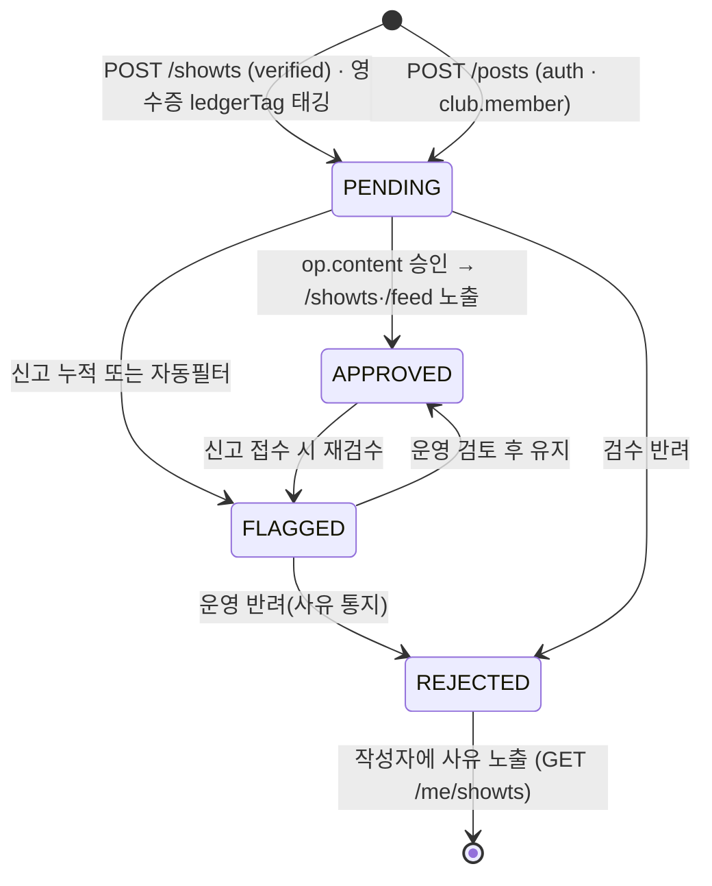

# 소셜·신뢰점수 저니 리뷰 — 쇼/쇼츠/DM/팔로우/신고 + 매너온도·정산준수율

## 1. 현재 플로우

현재 Flutter 앱에 **실제로 존재하는 소셜 화면은 4개뿐**이며, 전부 하드코딩 목데이터다. 나머지(공개 프로필·팔로우 목록·알림함·쇼 작성·게시글 상세)는 **React 프로토타입에만** 있고 Flutter에는 미구현 — 그래서 Flutter에서 작성자/아바타를 탭하면 모두 `_stub("준비 중인 화면이에요")`로 빠진다. 이게 구현됨/stub의 실제 경계다.

**구현된 5탭 중 소셜 영역 (모두 클라 하드코딩):**

| 화면 | 파일 | 상태 | 핵심 |
|---|---|---|---|
| 쇼 피드 (홈) | `home/show_feed_screen.dart` | 하드코딩 `_posts` 4개 + `_meetings` 3개 혼합 피드. 좋아요·댓글 카운트 정적. | 작성자/포스트 탭 → `_stub`. 커서 페이지네이션 없음(고정 7개) |
| 쇼츠 | `showts/showts_screen.dart` | 하드코딩 `_videos` 3개, 세로 스와이프. 좋아요 `_liked` 로컬 토글. 업로드 → `_stub`. | "투명 장부 인증"(`ledger:true`)·펀딩 배지 정적. 검수 상태 개념 없음 |
| DM | `chat/dm_list_screen.dart` | 하드코딩 `_convs` 4개. 채팅은 `_replies` 배열 순환하는 **가짜 자동응답**. | 새 대화 시작 → `_stub`. 스레드 생성/실서버 없음 |
| 마이 (신뢰점수) | `my/my_page_screen.dart` | `_temp = 37.8`, 팔로워 89/팔로잉 34, bio·관심사 전부 `static const`. `_mannerHero(t)`/`_mannerAccent(t)`가 **클라에서 온도→색 등급 파생**. | **§11 위반 소지의 핵심**. 팔로우 col 탭 → `_stub` |

**프로토타입에만 있는 화면 (Flutter 미구현):**
- `PublicProfileScreen` (f17988ed): 히어로(매너온도℃)·팔로우 버튼·신고(flag) 시트·활동/매너 탭(Arc 준수율 게이지·noshow·정산지연)·동아리·모임피드 그리드·DM 버튼. **점수/등급/매너를 `getGrade(score)`·`getManner(name,p)`로 클라에서 계산**.
- `FollowListScreen` (f17988ed): 팔로워/팔로잉 세그먼트, 인라인 팔로우 토글. `window.__moishoFollow` 전역 Set으로 상태 보관.
- `NotificationsScreen` (87338638): "참석 예정 모임" + 알림 6종(출금동의·펀딩마감·입금확인·새쇼글·가입신청·정산완료), 모두읽음, 딥링크(`action`).
- `ShowWriteScreen`·`PostDetailScreen` (87338638): 쇼 작성·게시글 상세+댓글.

**현재 전이 (프로토타입 기준):** 피드/쇼츠 작성자 탭 → PublicProfile → (팔로우 토글 | 신고 시트 | DM 버튼 → DmChat | 팔로워수 탭 → FollowList). 알림은 종탭 → Notifications → action 딥링크. Flutter에서는 이 전이 대부분이 `_stub`로 끊겨 있다.

---

## 2. 갭·논리모순·누락 엣지케이스

**[CRITICAL] 신뢰점수·매너온도가 클라이언트에서 하드코딩·파생됨 — §11 정면 위반**
문제는 "서버 점수를 표시"하는 게 아니라, 클라가 값을 **하드코딩**(`_temp=37.8`, 팔로워 89)하고 등급/매너를 **클라에서 계산**(`getGrade(score)`, `getManner`, `_mannerHero`가 온도 컷으로 색 분기)한다는 점이다. §11 "신뢰점수 산식을 클라이언트에 노출/하드코딩" 금지에 직접 걸린다. 예: `MANNER_MAP["박소심"]={punctual:72,noshow:2,response:65}`가 소스에 박혀 있어, 누구든 번들을 까면 산식·임계를 역산할 수 있다. 올바른 동작은 `/me/trust`(self)와 `/users/{id}`→`PublicProfile.trust`가 내려준 `score/grade/temp/manner`를 **그대로 렌더**하고, 클라는 등급 컷·색 임계를 **한 줄도 계산하지 않는** 것. (`openapi.yaml`은 이미 `TrustProfile`에 "산식은 서버 내부, 결과 필드만 노출"이라 명시.)

**[CRITICAL] 쇼 작성(ShowWrite) POST 엔드포인트 부재 — 설계된 화면이 갈 곳이 없음**
`grep`으로 확인: openapi에 `/posts/{id}/like`·`/posts/{id}/comments`는 있으나 **bare `/posts:` 컬렉션이 없다**. 즉 게시글 생성 API가 계약에 없는데 `ShowWriteScreen`은 설계된 화면이다. 피드 자체를 채울 수 없다. → `POST /posts` 신설 필요(verified는 불필요, `auth`로 충분 — 쇼 작성 권한은 `club.member`).

**[HIGH] DM 시작(스레드 생성) 불가 — PublicProfile의 DM 버튼이 데드엔드**
`/dm/threads`는 GET만 존재(line 419), `POST`가 없다. 메시지 전송(`POST /dm/threads/{id}/messages`)은 **이미 존재하는 스레드**에만 가능. 그런데 PublicProfile에 "DM 보내기" 버튼이 있어 처음 보는 유저와 대화를 시작해야 한다. 첫 메시지를 보낼 스레드를 만들 방법이 계약에 없다. → `POST /dm/threads {peerId}` 신설(멱등 합류: 동일 2인 스레드 중복 생성 금지).

**[HIGH] 차단(Block) 기능 전무 — 신고와 혼동되어 누락**
데이터정의서·프로토타입에 "차단"이 요구로 잡혀 있으나, openapi 전체에 block/mute 엔티티·엔드포인트가 **없다**(검색된 "차단"은 전부 에스크로 "취소 차단/출금 차단"). 신고(Report)는 운영팀 검토 큐일 뿐 **즉시 상호작용 차단이 아니다**. 악성 유저가 DM·팔로우로 계속 접근 가능. 신고만으로는 피해자 보호 불가. → `POST/DELETE /users/{id}/block` + 차단 시 DM/팔로우 자동 해제·노출 제거.

**[HIGH] Showts 검수 큐 상태가 작성자에게 노출 안 됨 — 업로드 후 깜깜이**
`ShowtsPage`에 `status: pending·flagged·approved·rejected`가 있고 `/showts` GET은 "승인분만" 반환. 그러나 작성자가 **자기 영상의 검수 상태를 조회할 화면/API가 없다**. 업로드(`POST /showts`, verified) 후 24h 검수 동안 영상이 어디 갔는지 알 수 없고, 반려(rejected) 사유도 못 본다. → `GET /me/showts?status=` 또는 `GET /showts/{id}`(작성자 self) 필요.

**[MEDIUM] Notification.kind는 자유 string인데 수신토글은 funding/show/member 3종뿐 — 금융/거버넌스 알림이 토글에 안 묶임**
`NotificationPrefs={funding,show,member}`. 그러나 프로토타입 알림에는 "총무 출금 동의 요청(payoutConsent)"·"정산 완료(settleAuto)"·"패널티(penalty)"가 있다. 이들은 funding도 show도 member도 아니다. 사용자가 funding을 꺼도 출금 동의 요청이 와야 하나(자금 거버넌스), 매핑이 모호. `Notification.kind`가 enum 제약 없는 string이라 클라가 분기 불가. → kind enum 명시 + `prefs`에 거버넌스/머니 카테고리 추가(단 출금동의·정산 등 자금 알림은 토글 불가 강제 권장).

**[MEDIUM] Showts 좋아요/댓글 API가 Post와 비대칭 — 좋아요 취소·댓글 조회 불가**
`grep` 확인: `/posts/{id}/like`는 POST+DELETE, `/posts/{id}/comments`는 GET+POST. 반면 `/showts/{id}/like`는 **POST만**(취소 불가), `/showts/{id}/comments`는 **POST만**(댓글 목록 조회 불가). 쇼츠에서 좋아요 잘못 눌러도 못 빼고, 댓글을 달 순 있는데 못 본다. 명백한 UX 모순. → DELETE like, GET comments 추가(MODIFY).

**[MEDIUM] 자기 자신 팔로우·중복 신고 가드 부재**
표준 에러코드(`docs/04`)에 `KYC_REQUIRED·ROUND_FULL·DEADLINE_PASSED·ALREADY_PAID·SETTLEMENT_INVALID`는 있으나 `SELF_FOLLOW`·`ALREADY_REPORTED`가 없다. `POST /users/{me}/follow` 호출 시 자기 팔로우가 막히지 않고, 동일 대상 반복 신고로 큐 폭주 가능. → 에러코드 신설(MEDIUM).

**[LOW] DM 목록·피드 커서 페이지네이션 누락**
`/dm/threads` GET에 cursor 없음. `/feed`·`/showts` GET은 cursor만 있고 `limit` 파라미터 없음(나머지 목록 API는 `?cursor=&limit=` 표준). 무한 스크롤 일관성 깨짐. → MODIFY로 파라미터 보강.

---

## 3. 개선된 유저 플로우

**핵심 원칙:** 신뢰 데이터는 100% 서버 산출(클라 0 계산), 피드·쇼츠·DM·알림은 커서 페이지네이션, 신고는 모더레이션 큐로/차단은 즉시 효력, Showts는 검수 통과분만 공개 + 작성자에게 상태 가시화.

**3-1. 소셜 탐색 → 프로필 → 관계 액션 (화면 추가: PublicProfile·FollowList를 Flutter로 신규 구현)**

```
[쇼 피드 / 쇼츠] 작성자·아바타 탭
        │  (현재 _stub → PublicProfileScreen으로 연결)
        ▼
[공개 프로필]  GET /users/{id}  → PublicProfile{trust, followers, following}
   ├─ 매너온도·등급·준수율: 서버값 그대로 렌더 (클라 계산 0)
   ├─ [+ 팔로우]   POST /users/{id}/follow      → 낙관적 토글, 실패 시 롤백
   ├─ [DM 보내기]  POST /dm/threads {peerId}    → threadId 받고 DmChat 진입
   ├─ [신고 ⚑]    POST /reports {targetType:user}
   ├─ [차단]       POST /users/{id}/block       → DM·팔로우 자동 해제 (신설)
   └─ [팔로워 N]   GET /users/{id}/followers?cursor=
                   GET /users/{id}/following?cursor=
```

**3-2. 쇼 작성·검수 (Showts 상태머신 — §4와 별개의 콘텐츠 모더레이션 라이프사이클)**



작성자는 `GET /me/showts?status=pending|rejected`로 자기 영상 상태·반려 사유를 확인(신규). 일반 피드 `GET /showts`는 APPROVED만.

**3-3. 신고 → 모더레이션 vs 차단 (둘을 분리)**

```
신고(Report): 운영팀 큐 적재 → op.content 검토 → 유지/숨김/정지. 신고자 비공개. 즉시 효력 없음.
차단(Block) : 즉시 효력. 차단 즉시 (1) 양방향 팔로우 해제 (2) DM 스레드 숨김/송신 차단 (3) 상대 피드·프로필 비노출.
→ 신고 시트 하단에 "차단도 함께" 옵션 제공(별도 API 호출).
```

**3-4. 알림 (수신 토글 정합)**

```
GET /me/notifications?cursor=&limit=  → NotificationPage
  kind: funding·show·member·payout_consent·settlement·penalty (enum 확정)
  PATCH /me/notifications/{id}  (읽음, self)
  PATCH /me/notification-prefs  (toggle) — 단 payout_consent·settlement·penalty는 토글 불가(자금 거버넌스 강제 수신)
```

**3-5. 신뢰점수 갱신 트리거 (서버 내부, 클라는 결과만)**
`docs/05`에 따라 정산준수율은 **정산 라이프사이클의 부산물**: SETTLING 단계에서 반납 데드라인(기본 12h) 초과 시 `TrustProfile.score` 자동 차감·`delays++`, 노쇼 시 `manner.noshow++`, 정상 정산 누적 시 회복. 클라는 `/me/trust`를 폴링/푸시로 갱신만 받음.

---

## 4. 백엔드 의존 데이터 — 샘플 JSON

```json
{
  "myTrust": {
    "_endpoint": "GET /me/trust  (self)",
    "score": 88,
    "grade": "good",
    "temp": 37.8,
    "manner": { "praises": 31, "punctual": 97, "noshow": 0, "response": 95 },
    "receiptRate": 95,
    "hosted": 3,
    "joined": 12,
    "delays": 0
  },

  "publicProfile": {
    "_endpoint": "GET /users/u_parkjh  (auth)",
    "id": "u_parkjh",
    "nickname": "박지훈",
    "photo": "https://cdn.moisho.app/u/u_parkjh.jpg",
    "bio": "와인과 요리, 주말엔 홈파티. 정산은 칼같이.",
    "interests": ["와인", "요리", "맛집투어", "홈파티"],
    "verified": true,
    "followers": 142,
    "following": 38,
    "trust": {
      "score": 91,
      "grade": "best",
      "temp": 38.4,
      "manner": { "praises": 31, "punctual": 97, "noshow": 0, "response": 95 },
      "receiptRate": 96,
      "hosted": 5,
      "joined": 21,
      "delays": 0
    }
  },

  "followers": {
    "_endpoint": "GET /users/u_parkjh/followers?cursor=&limit=20  (auth)",
    "items": [
      { "id": "u_hong", "nickname": "홍길동", "photo": "https://cdn.moisho.app/u/u_hong.jpg",
        "verified": true, "trust": { "grade": "good", "temp": 37.8 }, "isFollowing": false },
      { "id": "u_leemj", "nickname": "이민준", "photo": "https://cdn.moisho.app/u/u_leemj.jpg",
        "verified": true, "trust": { "grade": "trust", "temp": 37.1 }, "isFollowing": true }
    ],
    "nextCursor": "eyJpZCI6InVfbGVlbWoifQ"
  },

  "feed": {
    "_endpoint": "GET /feed?cursor=&limit=10  (auth)",
    "items": [
      { "id": "P-9001", "type": "post", "clubId": "club_sound",
        "clubName": "홍대 연합 밴드 '사운드'", "authorId": "u_jeongd", "authorName": "정디자",
        "tag": "봄MT", "text": "펜션 도착! 바베큐 준비 완료 🔥",
        "img": "https://cdn.moisho.app/p/P-9001.jpg",
        "likes": 24, "comments": 6, "liked": false,
        "time": "2026-06-24T05:30:00Z" },
      { "id": "P-9002", "type": "post", "clubId": "club_frame",
        "clubName": "서울 사진 동아리 '프레임'", "authorId": "u_leemj", "authorName": "이민준",
        "tag": "출사", "text": "한강 야경 출사. 오늘 빛이 예뻤어요 🌇",
        "img": "https://cdn.moisho.app/p/P-9002.jpg",
        "likes": 15, "comments": 4, "liked": true,
        "time": "2026-06-24T04:10:00Z" }
    ],
    "nextCursor": "eyJpZCI6IlAtOTAwMiJ9"
  },

  "showts": {
    "_endpoint": "GET /showts?cursor=&limit=5  (auth, 승인분만)",
    "items": [
      { "id": "ST-501", "authorId": "u_jeongs", "handle": "@sound_band",
        "clubId": "club_sound",
        "caption": "정기 대관 연습 찢었다.. 뒷풀이까지 완벽 #밴드 #홍대",
        "videoUrl": "https://cdn.moisho.app/v/ST-501.mp4", "duration": "0:25",
        "likes": 3200, "comments": 142, "liked": false,
        "ledgerTag": "set_2026_06_sound_r1", "status": "approved",
        "funding": { "active": true, "title": "06/15 정기 대관 연습", "dday": 2 } }
    ],
    "nextCursor": null
  },

  "myShowts": {
    "_endpoint": "GET /me/showts?status=pending  (self · 신규)",
    "items": [
      { "id": "ST-777", "caption": "이번 출사 하이라이트 #프레임",
        "videoUrl": "https://cdn.moisho.app/v/ST-777.mp4", "status": "pending",
        "rejectReason": null, "submittedAt": "2026-06-24T03:00:00Z" }
    ],
    "nextCursor": null
  },

  "dmThreads": {
    "_endpoint": "GET /dm/threads?cursor=&limit=20  (auth)",
    "items": [
      { "id": "dm_kimhj", "peerId": "u_kimhj", "peerName": "김회장",
        "peerRole": "president", "clubId": "club_sound",
        "online": true, "unread": 2,
        "lastMsg": "이번 주 합주실 예약했어요!", "lastTime": "2026-06-24T01:44:00Z" }
    ],
    "nextCursor": null
  },

  "dmMessages": {
    "_endpoint": "GET /dm/threads/dm_kimhj/messages?cursor=&limit=30  (auth)",
    "items": [
      { "id": "m_1", "senderId": "u_kimhj", "text": "이번 주 합주 참석 가능하세요?",
        "time": "2026-06-24T01:05:00Z" },
      { "id": "m_2", "senderId": "u_hong", "text": "네! 토요일 오후 2시 맞죠?",
        "time": "2026-06-24T01:07:00Z" }
    ],
    "nextCursor": null
  },

  "notifications": {
    "_endpoint": "GET /me/notifications?cursor=&limit=20  (self)",
    "items": [
      { "id": "N-1", "kind": "payout_consent", "title": "총무 출금 동의 요청",
        "body": "정기 합주 & 뒷풀이 — 총무가 480,000원 출금 동의를 요청했어요.",
        "action": "moisho://meetings/mt_sound_0615/payout-consent",
        "unread": true, "time": "2026-06-24T05:55:00Z" },
      { "id": "N-2", "kind": "settlement", "title": "정산 완료 — 잔액 적립",
        "body": "정기 대관 연습 정산 완료! +4,000P 적립.",
        "action": "moisho://meetings/mt_sound_0608/settlement",
        "unread": false, "time": "2026-06-21T09:00:00Z" },
      { "id": "N-3", "kind": "show", "title": "새 쇼 게시글",
        "body": "정디자님이 '봄MT 현장'을 올렸어요.",
        "action": "moisho://posts/P-9001", "unread": false,
        "time": "2026-06-24T03:30:00Z" }
    ],
    "nextCursor": null
  },

  "notificationPrefs": {
    "_endpoint": "GET /me/notification-prefs  (self)",
    "funding": true, "show": true, "member": true,
    "_locked": ["payout_consent", "settlement", "penalty"]
  }
}
```

---

## 5. API 정합 (요청 형식)

> 각 path는 `openapi.yaml`을 grep으로 직접 확인함. 멱등 머니 op는 이 저니에 **없음** — Idempotency-Key는 follow/report/DM/like에 붙이지 않는다(아래 자체검증 참조).

| 플로우 스텝 | 상태 | Method | URI | 설명 | Request 샘플 | Response 샘플 |
|---|---|---|---|---|---|---|
| 내 신뢰지표(마이) | **EXISTS** (113행) | GET | `/me/trust` | 산식 서버 내부, 결과만. 권한 `self` | — | `{"score":88,"grade":"good","temp":37.8,"manner":{"praises":31,"punctual":97,"noshow":0,"response":95},"delays":0}` |
| 공개 프로필 | **EXISTS** (138행) | GET | `/users/{id}` | `PublicProfile{trust,...}`. 권한 `auth` | — | `{"id":"u_parkjh","nickname":"박지훈","verified":true,"followers":142,"following":38,"trust":{"score":91,"grade":"best","temp":38.4}}` |
| 팔로우 | **EXISTS** (140행) | POST | `/users/{id}/follow` | 권한 `auth`. 자기팔로우 가드 추가 권장 | — | `204` |
| 언팔로우 | **EXISTS** (141행) | DELETE | `/users/{id}/follow` | 권한 `auth` | — | `204` |
| 팔로워 목록 | **MODIFY** (143행) | GET | `/users/{id}/followers?cursor=&limit=` | 권한 `auth`. **`limit`·응답 `{items,nextCursor}` 명시 추가** | — | `{"items":[{"id":"u_hong","nickname":"홍길동","isFollowing":false}],"nextCursor":"..."}` |
| 팔로잉 목록 | **MODIFY** (146행) | GET | `/users/{id}/following?cursor=&limit=` | 위와 동일 보강 | — | `{"items":[...],"nextCursor":null}` |
| 신고 | **EXISTS** (148행) | POST | `/reports` | 권한 `auth`, 신고자 비공개 → op.content 큐 | `{"targetType":"user","targetId":"u_xxx","reason":"unpaid"}` | `201 {"id":"R-301","status":"received"}` |
| 차단 | **NEW** | POST/DELETE | `/users/{id}/block` | 권한 `auth`. 차단 시 팔로우·DM 자동 해제. Report와 별개 | — | `204` |
| 쇼 피드 | **MODIFY** (405행) | GET | `/feed?cursor=&limit=` | 권한 `auth`. **`limit` 파라미터 추가** | — | `{"items":[{"id":"P-9001","type":"post","likes":24,"liked":false}],"nextCursor":"..."}` |
| 게시글 작성 | **NEW** | POST | `/posts` | 권한 `auth`+`club.member`. ShowWrite 대상. **bare `/posts:` 부재 확인됨** | `{"clubId":"club_sound","tag":"봄MT","text":"...","img":"..."}` | `201 {"id":"P-9003","status":"pending"}` |
| 게시글 좋아요/취소 | **EXISTS** (406행) | POST/DELETE | `/posts/{id}/like` | 권한 `auth` | — | `204` |
| 게시글 댓글 조회/작성 | **EXISTS** (409행) | GET/POST | `/posts/{id}/comments` | 권한 `auth` | `{"text":"멋져요"}` | `201 {"id":"C-77"}` |
| 쇼츠 피드 | **MODIFY** (413행) | GET | `/showts?cursor=&limit=` | 권한 `auth`, **승인분만**. `limit` 추가 | — | `{"items":[{"id":"ST-501","status":"approved","liked":false}],"nextCursor":null}` |
| 쇼츠 업로드 | **EXISTS** (414행) | POST | `/showts` | 권한 **`verified`** (403 KYC_REQUIRED). 검수 큐 진입(status=pending) | `{"caption":"...","tag":"공연","videoUrl":"...","ledgerTag":"set_..."}` | `201 {"id":"ST-777","status":"pending"}` |
| 쇼츠 좋아요 | **MODIFY** (415행) | POST | `/showts/{id}/like` | 권한 `auth`. **DELETE(취소) 추가** — Post와 비대칭 해소 | — | `204` |
| 쇼츠 댓글 | **MODIFY** (417행) | POST | `/showts/{id}/comments` | 권한 `auth`. **GET(조회) 추가** — 목록 못 봄 | `{"text":"골 장면 다시!"}` | `201` |
| 내 쇼츠 상태 | **NEW** | GET | `/me/showts?status=pending` | 권한 `self`. 검수/반려 사유 가시화 | — | `{"items":[{"id":"ST-777","status":"rejected","rejectReason":"저작권 음원"}],"nextCursor":null}` |
| DM 목록 | **MODIFY** (419행) | GET | `/dm/threads?cursor=&limit=` | 권한 `auth`. **커서 파라미터 추가** | — | `{"items":[{"id":"dm_kimhj","peerId":"u_kimhj","unread":2}],"nextCursor":null}` |
| DM 시작 | **NEW** | POST | `/dm/threads` | 권한 `auth`. 동일 2인 스레드 멱등 합류(중복생성 금지) | `{"peerId":"u_parkjh"}` | `201 {"id":"dm_parkjh","peerId":"u_parkjh"}` |
| DM 대화 조회 | **EXISTS** (421행) | GET | `/dm/threads/{id}/messages?cursor=` | 권한 `auth` | — | `{"items":[{"id":"m_1","senderId":"u_kimhj","text":"..."}],"nextCursor":null}` |
| DM 전송 | **EXISTS** (421행) | POST | `/dm/threads/{id}/messages` | 권한 `auth`. 운영팀 스레드는 CS로 | `{"text":"네 토요일 봬요"}` | `201 {"id":"m_3"}` |
| 알림함 | **EXISTS** (114행) | GET | `/me/notifications?cursor=&limit=` | 권한 `self` | — | `{"items":[{"id":"N-1","kind":"payout_consent","unread":true}],"nextCursor":null}` |
| 알림 읽음 | **EXISTS** (120행) | PATCH | `/me/notifications/{id}` | 권한 `self` | — | `204` |
| 알림 수신토글 | **MODIFY** (122행) | GET/PATCH | `/me/notification-prefs` | 권한 `self`. **`payout_consent·settlement·penalty`는 강제수신(토글 불가) + Notification.kind enum 확정** | `{"funding":false,"show":true,"member":true}` | `{"funding":false,"show":true,"member":true}` |

### §4/§11 자체검증

- **회원 간 송금 API 추가했나?** — 아니오. DM 시작/메시지·팔로우·신고·차단·쇼 작성은 전부 **콘텐츠/관계 API**이며 포인트·금액을 1원도 이동시키지 않는다. LedgerEntry를 건드리는 신규 API 없음.
- **포인트를 모임 정산 외 용도로?** — 아니오. 단, **§11 트랩 경고**: 현재 "쇼 이벤트 — 후기 올리고 커피 기프티콘" 보상은 **앱 포인트로 지급하면 안 됨**(포인트=모임 정산 목적 한정). 콘텐츠 보상은 외부 기프티콘 등 **오프-원장**으로 처리하고 **LedgerEntry로 절대 분개하지 않는다**.
- **충전·출금 수수료 부과?** — 해당 없음. 이 저니에 충전/현금화 op 없음.
- **원장 수정·삭제?** — 없음. 신뢰점수 차감/회복은 `TrustProfile.score`(파생 캐시) 갱신이지 LedgerEntry 변경이 아니다. 패널티가 **포인트 차감**을 수반할 경우엔 반드시 `type:"penalty"` **신규 분개**로(append-only) 처리 — 기존 분개 수정 금지.
- **멱등 누락?** — 이 저니는 머니 op가 없어 **Idempotency-Key가 원칙적으로 N/A**. 단 신설 `POST /dm/threads`는 멱등 **합류**(동일 2인 중복 스레드 금지)를 요청 의미론으로 보장하되, 이는 머니 멱등이 아니라 리소스 중복 방지다.
- **verified 게이트 누락?** — 점검 완료. 금융 성격인 **Showts 업로드만 `verified`**(403 KYC_REQUIRED), 나머지 소셜(피드·팔로우·DM·신고·차단·댓글·쇼 작성)은 설계서대로 `auth`. 신뢰지표 조회는 `self`. verified 게이트를 소셜에 과잉 적용하지 않음.
- **신뢰점수 산식 클라 노출?** — **수정 대상으로 명시**. 현 Flutter/프로토타입의 클라 하드코딩·`getGrade`/`getManner`/`_mannerHero` 파생을 제거하고, `/me/trust`·`PublicProfile.trust`의 서버값을 그대로 렌더하도록 전환(클라 등급 컷 계산 0). PublicProfile이 manner 상세(noshow·delays·response%)를 **공개 노출**하는 것은 산식이 아닌 **결과 신호 공개**이므로 §11 위반 아님 — 의도된 신뢰 시그널로 유지.
```
